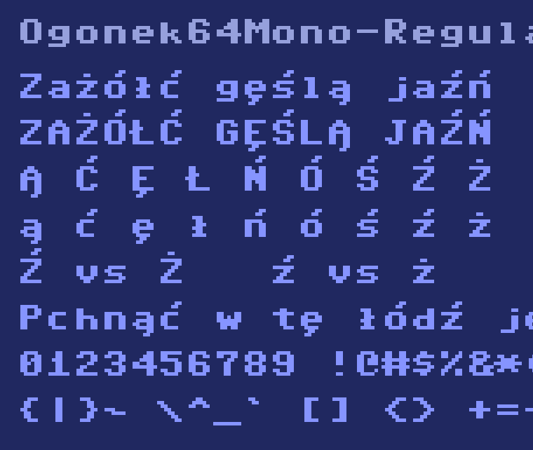

# Ogonek 64

Pikselowy krój pisma w siatce 8×12 **z pełnym zestawem polskich znaków** — czyli to,
czego oryginał nigdy nie miał. Do tego **komplet GF Latin Core (319 znaków)**: akcenty
francuskie, niemieckie, czeskie, węgierskie, skandynawskie, waluty i interpunkcja.
Cztery odmiany, licencja SIL OFL 1.1, budowa z czytelnego źródła tekstowego.

✅ **Przechodzi QA Google Fonts bez zarzutu** — `fontbakery check-googlefonts`:
**0 FAIL** na 455 kontrolach dla każdej z trzech rodzin.



## Odmiany

| plik | rodzina | styl | do czego |
|---|---|---|---|
| `Ogonek64Mono-Regular.ttf` | Ogonek 64 Mono | Regular | terminal, kod, wszystko o stałej szerokości |
| `Ogonek64Mono-Bold.ttf` | Ogonek 64 Mono | Bold | pogrubienie w tej samej rodzinie, więc terminal użyje go sam |
| `Ogonek64Sans-Regular.ttf` | Ogonek 64 Sans | Regular | teksty ciągłe — szerokość liczona per litera |
| `Ogonek64CRT-Regular.ttf` | Ogonek 64 CRT | Regular | linie wygaszenia i poświata kineskopu |

Każda odmiana ma **321 znaków**: pełne ASCII `0x20–0x7E`, 18 polskich diakrytów, komplet
**GF Latin Core** (akcenty europejskie, `Æ Ø Þ Ð Œ ß`, waluty `€ ¢ ¥`, symbole `© ® ™ × ÷`),
14 akcentów składających o zerowej szerokości, polską interpunkcję (`„ ” ‚ ’ – — …`)
oraz znaki z oryginalnego zestawu (`£ ↑ ←`).

## Polskie znaki

`Ą Ć Ę Ł Ń Ó Ś Ź Ż ą ć ę ł ń ó ś ź ż` — zaprojektowane od nowa, bo w pierwowzorze
nie istnieją. Cztery decyzje, które warto znać:

- **Akcent ma DWA własne wiersze i piksel odstępu od litery.** Bez odstępu `Ż` czyta się
  jak `Z` z guzem; przy jednym wierszu `ˆ ˇ ˘ ˚ ¨ ˜ ˝` zlewają się w tę samą plamkę.
  Cena: komórka 8×12 zamiast 8×8, czyli interlinia 1.5 em.
- **Pozycja akcentu jest wyliczana z górnej krawędzi litery**, nie wpisana na sztywno.
  Wielkie litery, wznoszące (`d k l t`) i x-height mają trzy różne wysokości — sztywny
  podział wywracał się na 13 znakach. Akcent nad `i`/`j` zastępuje kropkę.
- **`Ź` i `Ż` różnią się GRUBOŚCIĄ, nie pozycją** — kreska 2 px przesunięta w prawo
  kontra kropka 1 px na środku. Rozróżnianie samym przesunięciem o piksel nie działa;
  sprawdzone i odrzucone.
- **Kreska w `Ł`/`ł` jest wyliczana z pozycji trzonu litery**, nie wpisana na sztywno.
  Trzon `L` siedzi w kolumnach 1–2, a `l` w 3–4, więc sztywna kreska wyjeżdżałaby
  poza małą literę.

## Skąd biorą się glify

Baza łacińska odwzorowuje krój znakowy domowego komputera 8-bitowego z 1982 roku.
W repozytorium **nie ma żadnej binarki ROM** — źródłem jest `sources/glify-*.txt`,
czytelny plik tekstowy, w którym `#` to zapalony piksel, a `.` zgaszony:

```
U+0104 LATIN CAPITAL LETTER A WITH OGONEK
........      <- wiersz akcentu (górny)
........      <- wiersz akcentu (dolny)
........      <- odstęp
...##...
..####..
.##..##.
.######.
.##..##.
.##..##.
.##..##.
.....##.      <- ogonek
....##..
```

Kształty liter nie podlegają prawu autorskiemu w USA (`37 CFR § 202.1(e)`,
*Eltra Corp. v. Ringer*, 4th Cir. 1978), a przy siatce 8×8 nie ma w nich miejsca na
twórczy wybór — czytelna wielka litera alfabetu łacińskiego ma w tej rozdzielczości
jedno sensowne rozwiązanie. Szczegóły i źródła: [`documentation/PRAWO.md`](documentation/PRAWO.md).

Diakryty, interpunkcja polska i osiem znaków ASCII, których pierwowzór nie ma
(`\ ^ _ \` { | } ~`), są zaprojektowane w tym projekcie od zera.

## Budowa

Wszystko jednym poleceniem — skrypt sam zakłada `.venv` i doinstalowuje zależności
z `requirements.txt`, nie dotykając pakietów systemowych:

```bash
./build.sh
```

Wynik: `fonts/ttf/*.ttf` + `fonts/webfonts/*.woff2`, na koniec kontrola.
Przełączniki: `--skip-tests` (bez kontroli), `--no-venv` (użyj `python3` z PATH).

Poszczególne kroki, gdyby trzeba było uruchomić je osobno:

```bash
.venv/bin/python sources/zrob_glify.py   # glify pochodne -> sources/glify-{dodatki,pl}.txt
.venv/bin/python sources/glify_latin.py  # GF Latin Core -> sources/glify-latin.txt
.venv/bin/python sources/buduj.py        # -> fonts/ttf/*.ttf
.venv/bin/python sources/webfonts.py     # -> fonts/webfonts/*.woff2
.venv/bin/python tests/kontrola.py       # tabele + pokrycie Latin Core + rendery do build/
```

### Układ katalogów

Zgodny z [preferowaną strukturą Google Fonts](https://googlefonts.github.io/gf-guide/upstream.html):
`sources/` (źródła glifów i skrypty budujące) · `fonts/` (gotowe binaria) ·
`documentation/` (materiały i obrazki) · `tests/` (kontrola) · `AUTHORS.txt` ·
`CONTRIBUTORS.txt` · `OFL.txt` · `requirements.txt` · `build.sh`.
Katalog `build/` jest efemeryczny (rendery kontrolne) i nie wchodzi do repozytorium.

QA profilem Google Fonts (katalog `gf/` ma układ wymagany przez repozytorium `google/fonts`):

```bash
.venv/bin/pip install fontbakery shaperglot gftools glyphsets
.venv/bin/fontbakery check-googlefonts --succinct -l FAIL gf/ofl/ogonek64mono/*.ttf
```

🔴 Uruchamiaj QA na kopii **poza** drzewem projektu — inaczej kontrola `has_license`
zobaczy nasz główny `OFL.txt` w katalogu wyżej i zgłosi „dwie licencje".

## Instalacja

```bash
cp fonts/ttf/*.ttf ~/Library/Fonts/                 # macOS
cp fonts/ttf/*.ttf ~/.local/share/fonts/ && fc-cache -f   # Linux
```

## Geometria

```
unitsPerEm 2048, 1 piksel = 256 jednostek

 wiersze 0,1  2560 .. 2048   akcent (dwa wiersze)         ascender  2560
 wiersz 2     2048 .. 1792   odstęp akcentu
 wiersze 3..9 1792 ..    0   korpus                       capHeight 1792
                              małe litery od wiersza 5    x-height  1280
 wiersz 10       0 ..  -256  descender: g j p q y
 wiersz 11    -256 ..  -512  dolny wiersz ogonka          descender  -512
```

Nazwy plików trzymają konwencję Google Fonts (`Rodzina-Styl.ttf`, bez spacji), `fsType 0`,
`OS/2` w wersji 4 z bitem `USE_TYPO_METRICS`, tabele `gasp` i `prep` (smart dropout),
kontury zgodne z ruchem wskazówek zegara.

Piksele nie są zapisywane jako osobne prostokąty — najpierw scalane w poziome ciągi,
potem w pionowe bloki, na końcu `removeOverlaps` (skia-pathops) zlepia je w jeden
kontur na glif.

## Licencja i autorstwo

**Zrobił to SMOK** — Arek Bronowicki. Nazwa siedzi w metadanych każdego pliku, w polach
`designer` i `manufacturer`, więc widać ją w każdym menedżerze czcionek.

ℹ️ Pole `copyright` ma brzmienie narzucone przez Google Fonts —
*„Copyright 2026 The Ogonek 64 … Project Authors (adres repozytorium)"*. Ich kontrola
`font_copyright` porównuje ten napis ze wzorem znak w znak i nie dopuszcza nazwy autora
w tym miejscu; stąd autorstwo wskazują `designer`, `manufacturer` i `AUTHORS.txt`.

Font i skrypty: **SIL Open Font License 1.1** — [`OFL.txt`](OFL.txt), **bez**
Reserved Font Name.

Co to znaczy w praktyce:

- ✅ **Używaj do czego chcesz** — prywatnie, w firmie, komercyjnie, w grach, na stronach.
- ✅ **Modyfikuj** — dorysuj glify, zmień metryki, zrób własną odmianę.
- ✅ **Rozpowszechniaj** i wtapiaj w oprogramowanie, także płatne.
- ⚠️ **Zostaw notę o autorstwie.** OFL wymaga, żeby nota copyright i tekst licencji
  jechały razem z fontem — również w Twojej zmodyfikowanej wersji. To jedyny warunek,
  o który proszę, i jednocześnie jedyny, który licencja narzuca.
- ❌ Nie sprzedawaj samego fonta jako produktu.

Jeśli użyjesz go w czymś fajnym — daj znać, będzie mi miło. To prośba, nie paragraf.

## Jak powstał — udział narzędzi AI

Mówię o tym wprost, bo lepiej wiedzieć, co się instaluje.

Font jest **generowany kodem**, nie rysowany w edytorze fontów. Kod (`sources/*.py`),
skrypty kontroli i to README powstały **z pomocą asystenta AI** — Claude (Anthropic) —
prowadzonego i weryfikowanego przeze mnie.

Podział jest taki:

- **Baza łacińska** to odwzorowanie kroju znakowego 8-bitowego komputera z 1982 roku,
  wyeksportowane **jeden raz** jako mapa pikseli i od tej chwili utrzymywane jako plik
  tekstowy w tym repozytorium. Nie jest niczyim rysunkiem — to siatka 8×8, w której
  czytelna litera ma jedno sensowne rozwiązanie (patrz [`documentation/PRAWO.md`](documentation/PRAWO.md)).
- **Diakryty, interpunkcja i znaki GF Latin Core** są składane **deterministycznie**:
  litera bazowa + akcent, wg reguł zapisanych w `sources/zrob_glify.py`
  i `sources/glify_latin.py`. Ten sam wsad zawsze daje ten sam wynik — dwa niezależne
  buildy różnią się wyłącznie datą w tabeli `head`.
- **Decyzje kształtu podejmował i zatwierdzał człowiek, na renderach.** To one
  zdecydowały o jakości, i żadnej nie da się wyprowadzić z reguły: dwa wiersze akcentu
  zamiast jednego, piksel odstępu między akcentem a literą, rozróżnianie `Ź`/`Ż`
  grubością zamiast pozycją, kreska `Ł` liczona z trzonu litery, akcent zastępujący
  kropkę nad `i`/`j`. Każda z nich wzięła się z obejrzenia wydruku i uznania, że
  poprzednia wersja jest nieczytelna — kontrole tabel przepuszczały obie.

Krótko: **narzędzie pisało kod, człowiek decydował, jak font ma wyglądać, i to sprawdzał.**

## Zastrzeżenie

Projekt **nieoficjalny**, robiony z sympatii do sprzętu. Nie jest powiązany
z właścicielem marki Commodore ani przez niego wspierany. Nazwy handlowe należą
do swoich właścicieli i nie występują w nazwach fontów.
