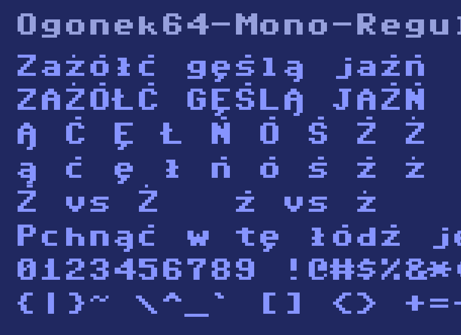

# Ogonek 64

Pikselowy krój pisma w siatce 8×11 **z pełnym zestawem polskich znaków** — czyli to,
czego oryginał nigdy nie miał. Cztery odmiany, licencja SIL OFL 1.1, budowa z czytelnego
źródła tekstowego.



## Odmiany

| plik | rodzina | styl | do czego |
|---|---|---|---|
| `Ogonek64-Mono-Regular.ttf` | Ogonek 64 Mono | Regular | terminal, kod, wszystko o stałej szerokości |
| `Ogonek64-Mono-Bold.ttf` | Ogonek 64 Mono | Bold | pogrubienie w tej samej rodzinie, więc terminal użyje go sam |
| `Ogonek64-Sans-Regular.ttf` | Ogonek 64 Sans | Regular | teksty ciągłe — szerokość liczona per litera |
| `Ogonek64-CRT-Regular.ttf` | Ogonek 64 CRT | Regular | linie wygaszenia i poświata kineskopu |

Każda odmiana ma **124 znaki**: pełne ASCII `0x20–0x7E` (95), 18 polskich diakrytów,
polską interpunkcję (`„ ” ‚ ’ – — …`) i kilka znaków z oryginalnego zestawu (`£ ↑ ←`).

## Polskie znaki

`Ą Ć Ę Ł Ń Ó Ś Ź Ż ą ć ę ł ń ó ś ź ż` — zaprojektowane od nowa, bo w pierwowzorze
nie istnieją. Trzy decyzje, które warto znać:

- **Akcent ma własny wiersz i 1 piksel odstępu od litery.** Bez tego `Ż` czyta się
  jak `Z` z guzem, a `Ź` i `Ż` stają się nierozróżnialne. Cena: komórka 8×11 zamiast
  8×8, czyli interlinia 1.375 em.
- **`Ź` i `Ż` różnią się GRUBOŚCIĄ, nie pozycją** — kreska 2 px przesunięta w prawo
  kontra kropka 1 px na środku. Rozróżnianie samym przesunięciem o piksel nie działa;
  sprawdzone i odrzucone.
- **Kreska w `Ł`/`ł` jest wyliczana z pozycji trzonu litery**, nie wpisana na sztywno.
  Trzon `L` siedzi w kolumnach 1–2, a `l` w 3–4, więc sztywna kreska wyjeżdżałaby
  poza małą literę.

## Skąd biorą się glify

Baza łacińska odwzorowuje krój znakowy domowego komputera 8-bitowego z 1982 roku.
W repozytorium **nie ma żadnej binarki ROM** — źródłem jest `src/glify-*.txt`,
czytelny plik tekstowy, w którym `#` to zapalony piksel, a `.` zgaszony:

```
U+0104 LATIN CAPITAL LETTER A WITH OGONEK
........
...##...
..####..
.##..##.
.######.
.##..##.
.##..##.
.##..##.
.....##.
....##..
```

Kształty liter nie podlegają prawu autorskiemu w USA (`37 CFR § 202.1(e)`,
*Eltra Corp. v. Ringer*, 4th Cir. 1978), a przy siatce 8×8 nie ma w nich miejsca na
twórczy wybór — czytelna wielka litera alfabetu łacińskiego ma w tej rozdzielczości
jedno sensowne rozwiązanie. Szczegóły i źródła: [`docs/PRAWO.md`](docs/PRAWO.md).

Diakryty, interpunkcja polska i osiem znaków ASCII, których pierwowzór nie ma
(`\ ^ _ \` { | } ~`), są zaprojektowane w tym projekcie od zera.

## Budowa

```bash
python3 -m venv .venv --system-site-packages
.venv/bin/pip install "fonttools[pathops,woff]" pillow

.venv/bin/python lib/zrob_glify.py     # glify pochodne -> src/glify-{dodatki,pl}.txt
.venv/bin/python lib/buduj.py          # -> build/*.ttf
.venv/bin/python tests/kontrola.py     # kontrola tabel + rendery PNG
```

Wariant ciasny, bez odstępu akcentu (8×10, interlinia 1.25 em):

```bash
OGONEK_ODSTEP=0 .venv/bin/python lib/buduj.py   # -> build-ciasny/
```

## Instalacja

```bash
cp build/*.ttf ~/Library/Fonts/                 # macOS
cp build/*.ttf ~/.local/share/fonts/ && fc-cache -f   # Linux
```

## Geometria

```
unitsPerEm 2048, 1 piksel = 256 jednostek

 wiersz 0     2304 .. 2048   akcent nad wielką literą     ascender  2304
              2048 .. 1792   odstęp akcentu (1 px)
 wiersze 1..7 1792 ..    0   korpus                       capHeight 1792
                              małe litery od wiersza 3    x-height  1280
 wiersz 8        0 ..  -256  descender: g j p q y
 wiersz 9     -256 ..  -512  dolny wiersz ogonka          descender  -512
```

Piksele nie są zapisywane jako osobne prostokąty — najpierw scalane w poziome ciągi,
potem w pionowe bloki, na końcu `removeOverlaps` (skia-pathops) zlepia je w jeden
kontur na glif.

## Licencja i autorstwo

**Zrobił to SMOK** — Arek Bronowicki. Nazwa siedzi w metadanych każdego pliku
(`copyright`, `manufacturer`, `designer`, `unique ID`), więc widać ją w każdym
menedżerze czcionek, nie tylko w tym README.

Font i skrypty: **SIL Open Font License 1.1** — [`OFL.txt`](OFL.txt), **bez**
Reserved Font Name.

Co to znaczy w praktyce:

- ✅ **Używaj do czego chcesz** — prywatnie, w firmie, komercyjnie, w grach, na stronach.
- ✅ **Modyfikuj** — dorysuj glify, zmień metryki, zrób własną odmianę.
- ✅ **Rozpowszechniaj** i wtapiaj w oprogramowanie, także płatne.
- ⚠️ **Zostaw notę o autorstwie.** OFL wymaga, żeby nota copyright i tekst licencji
  jechały razem z fontem — również w Twojej zmodyfikowanej wersji. To jedyny warunek,
  o który proszę, i jednocześnie jedyny, który licencja narzuca.
- ❌ Nie sprzedawaj samego fonta jako produktu.

Jeśli użyjesz go w czymś fajnym — daj znać, będzie mi miło. To prośba, nie paragraf.

## Zastrzeżenie

Projekt **nieoficjalny**, robiony z sympatii do sprzętu. Nie jest powiązany
z właścicielem marki Commodore ani przez niego wspierany. Nazwy handlowe należą
do swoich właścicieli i nie występują w nazwach fontów.
